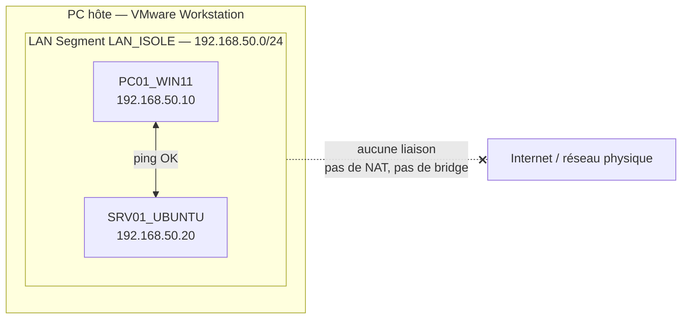

# Réseau virtuel isolé — Labo de test sans accès Internet

> Projet du module *Mettre en place et exploiter une plateforme de virtualisation* (Module 190) — Geneva Institute of Technology, Bachelor IT 1re année.

**Contexte :** créer un labo de test pour essayer mises à jour, logiciels ou configurations sans risque pour la production : un réseau virtuel isolé où les VM communiquent entre elles, avec la preuve qu'elles n'ont aucun accès à Internet ni au réseau physique.

**Technologies :** VMware Workstation (LAN Segment) · Windows 11 · Ubuntu · PowerShell · nftables

**Compétences mises en œuvre :**
- Choix du type de commutateur virtuel (LAN Segment vs Host-only / NAT / Bridged)
- Adressage statique sans passerelle ni DNS, règle pare-feu ICMP
- Plan de tests et preuve de l'isolation (Internet, DNS, réseau physique)
- Conception d'une sortie contrôlée via VM passerelle filtrante (nftables, politique drop par défaut)

---

## 1. Contexte et objectif

Une entreprise veut un **labo de test** pour essayer des mises à jour, des logiciels ou des configurations sans risquer d'impacter le réseau de production ni d'exposer les machines à Internet. Le but de ce projet est de créer un **réseau virtuel isolé** et d'y connecter plusieurs VM. Il faut ensuite **prouver** que ces VM communiquent entre elles mais n'ont **aucun accès** à Internet ni au réseau physique.

## 2. Environnement

| Élément | Valeur |
|---|---|
| Hyperviseur | VMware Workstation |
| Réseau virtuel isolé | LAN Segment `LAN_ISOLE` |
| Plan d'adressage | `192.168.50.0/24` — IP statiques, **sans passerelle ni DNS** |
| VM 1 | `PC01_WIN11` — Windows 11 — `192.168.50.10/24` |
| VM 2 | `SRV01_UBUNTU` — Ubuntu — `192.168.50.20/24` |
| VM passerelle (optionnelle) | `GW01` — `192.168.50.1/24` (voir §7) |

> **Pourquoi un LAN Segment ?** La consigne demande un commutateur virtuel de type *interne*. Dans VMware Workstation, c'est le **LAN Segment** qui y correspond le mieux : il s'agit d'un switch virtuel qui relie seulement les VM, sans lien avec la carte physique, sans NAT et sans DHCP. Le **Host-only** ajouterait l'hôte au réseau, et le **NAT** comme le **Bridged** donneraient un accès vers l'extérieur.
> *(Équivalent Hyper-V : commutateur « Interne » ou « Privé ».)*

## 3. Schéma réseau



*Figure 1 — Schéma du labo isolé : les VM sont reliées entre elles, sans aucune sortie vers l'extérieur.*

## 4. Création du réseau virtuel isolé

Le LAN Segment se crée depuis les paramètres de la carte réseau d'une VM (VM éteinte).

**1. Ouvrir les paramètres de la carte réseau.** Clic droit sur la VM → **Settings** → **Network Adapter**. La carte était jusqu'ici sur un réseau VMware (`Custom (VMnet8)`). On coche **LAN segment**, puis on clique sur **LAN Segments…** pour créer le segment.


*Figure 2 — Virtual Machine Settings : sélection de l'option « LAN segment » et ouverture du gestionnaire « LAN Segments… ».*

**2. Créer le segment.** Dans la fenêtre **Global LAN Segments**, on clique sur **Add** et on nomme le segment `LAN_ISOLE`, puis **OK**. Ce segment est global : il pourra être réutilisé par toutes les VM du labo.


*Figure 3 — Fenêtre « Global LAN Segments » : création du segment `LAN_ISOLE`.*

**3. Rattacher la carte au segment.** De retour dans les paramètres, on sélectionne `LAN_ISOLE` dans la liste déroulante sous « LAN segment », puis **OK**. La VM n'a qu'une seule carte réseau : elle n'est donc plus reliée à aucun réseau VMware (NAT, Host-only, Bridged).


*Figure 4 — Sélection du segment `LAN_ISOLE` pour la carte réseau de la VM.*

> Même manipulation à refaire sur la deuxième VM, en choisissant le même segment `LAN_ISOLE` (sans le recréer).

## 5. Connexion des VM au réseau

Les deux VM utilisent une seule carte réseau, branchée sur `LAN_ISOLE`. Le LAN Segment n'a pas de serveur DHCP : on configure donc des **adresses IP statiques**, en laissant volontairement **la passerelle et le DNS vides**. Sans passerelle, aucune VM ne sait comment joindre un réseau extérieur.

| VM | Adresse IP | Masque | Passerelle | DNS |
|---|---|---|---|---|
| `PC01_WIN11` | `192.168.50.10` | `255.255.255.0` (/24) | *(vide)* | *(vide)* |
| `SRV01_UBUNTU` | `192.168.50.20` | `255.255.255.0` (/24) | *(vide)* | *(vide)* |

### 5.1 PC01_WIN11 (Windows 11)

Panneau de configuration → **Centre Réseau et partage** → **Modifier les paramètres de la carte** → clic droit sur *Ethernet0* → **Propriétés** → **Protocole Internet version 4 (TCP/IPv4)** → « Utiliser l'adresse IP suivante ».


*Figure 5 — PC01_WIN11 : IP `192.168.50.10/24`, passerelle et DNS vides.*

Le pare-feu Windows bloque le ping entrant par défaut. On l'autorise (PowerShell en administrateur) :
```powershell
New-NetFirewallRule -DisplayName "ICMPv4-In LAB" -Protocol ICMPv4 -IcmpType 8 -Direction Inbound -Action Allow
```

### 5.2 SRV01_UBUNTU (Ubuntu Desktop)

**Paramètres** → **Réseau** → ⚙️ de la connexion *Filaire* → onglet **IPv4** → méthode **Manuel**, puis **Appliquer** et désactiver / réactiver la connexion.


*Figure 6 — SRV01_UBUNTU : IP `192.168.50.20/24`, passerelle vide, DNS vide (« Automatique » désactivé).*

## 6. Tests de connectivité et preuve de l'isolation

### 6.1 Communication entre les VM du labo

Les deux VM doivent se joindre, puisqu'elles sont sur le même segment et le même sous-réseau.


*Figure 7 — PC01_WIN11 → SRV01_UBUNTU : 4 paquets envoyés, 4 reçus, 0 % de perte.*


*Figure 8 — SRV01_UBUNTU → PC01_WIN11 : 4 paquets transmis, 4 reçus, 0 % de perte.*

### 6.2 Isolation : aucun accès à Internet

On tente de joindre un serveur public (`8.8.8.8`, DNS de Google). Le ping doit échouer.


*Figure 9 — PC01_WIN11 → 8.8.8.8 : « Échec de la transmission », 100 % de perte.*


*Figure 10 — SRV01_UBUNTU → 8.8.8.8 : « Le réseau n'est pas accessible ». Le système n'a aucune route vers l'extérieur.*

### 6.3 Isolation : pas de résolution DNS

Sans serveur DNS configuré, la VM ne peut pas traduire un nom de domaine en adresse IP.


*Figure 11 — PC01_WIN11 : `nslookup google.com` → « No response from server ». Aucun serveur DNS n'est joignable.*

### 6.4 Isolation : pas d'accès au réseau physique (PC hôte)

On tente de joindre l'adresse IP du PC hôte depuis les deux VM. Le LAN Segment n'étant relié à aucune carte réseau de l'hôte, le ping doit échouer.


*Figure 12 — PC01_WIN11 → PC hôte : « Échec de la transmission », 100 % de perte.*


*Figure 13 — SRV01_UBUNTU → PC hôte : « Le réseau n'est pas accessible ».*

### 6.5 Récapitulatif des tests

| # | Test | Depuis | Commande | Résultat attendu | Résultat obtenu |
|---|---|---|---|---|---|
| 1 | VM → VM | WIN11 | `ping 192.168.50.20` | ✅ Réponses | ✅ 4 envoyés / 4 reçus, 0 % de perte (< 1 à 2 ms) |
| 2 | VM → VM | UBUNTU | `ping -c 4 192.168.50.10` | ✅ Réponses | ✅ 4 transmitted / 4 received, 0 % packet loss (≈ 1 ms) |
| 3 | Internet (IP) | WIN11 | `ping 8.8.8.8` | ❌ « Échec de la transmission » / injoignable | ✅ Échec : 4 envoyés / 0 reçu, 100 % de perte (« Défaillance générale ») |
| 4 | Internet (IP) | UBUNTU | `ping -c 4 8.8.8.8` | ❌ `Network is unreachable` | ✅ Échec : « Le réseau n'est pas accessible » |
| 5 | DNS | WIN11 | `nslookup google.com` | ❌ Aucun serveur DNS | ✅ Échec : « No response from server » |
| 6 | Réseau physique (PC hôte) | WIN11 / UBUNTU | `ping <IP du PC hôte>` | ❌ Injoignable | ✅ Échec sur les 2 VM : 100 % de perte / « Le réseau n'est pas accessible » |

**Bilan : les 6 tests donnent le résultat attendu.** Les VM du labo communiquent entre elles, mais n'ont accès ni à Internet, ni au DNS, ni au réseau physique.

## 7. VM passerelle avec filtrage (évolution possible)

*Étape optionnelle de la consigne, non mise en œuvre dans ce labo, présentée ici comme évolution possible.* Le principe est d'ajouter une VM `GW01` avec **deux cartes réseau** :

- une carte dans `LAN_ISOLE` (`192.168.50.1`), qui devient la passerelle des VM du labo ;
- une carte en NAT, vers l'extérieur.

Avec cette architecture, l'isolation ne repose plus sur l'absence de lien mais sur les **règles de filtrage** de `GW01`. Exemple avec nftables sur Ubuntu, où tout est refusé par défaut :

```bash
# /etc/nftables.conf (extrait)
table inet filtre {
  chain forward {
    type filter hook forward priority 0; policy drop;   # tout est bloqué par défaut
    ct state established,related accept
    # ip saddr 192.168.50.0/24 tcp dport 443 accept   # exemple : n'autoriser que HTTPS si besoin
  }
}
```

## 8. Règles d'isolation (récapitulatif)

| Règle | Mise en œuvre |
|---|---|
| Les VM du labo communiquent entre elles | Même LAN Segment `LAN_ISOLE`, même sous-réseau `192.168.50.0/24` |
| Pas d'accès à Internet | Aucune carte en NAT ou Bridged, aucune passerelle par défaut, aucun DNS |
| Pas d'accès au réseau physique | Le LAN Segment n'est relié à aucune carte de l'hôte (≠ Bridged / Host-only) |
| Pas d'adresse attribuée automatiquement | Pas de serveur DHCP sur le segment, IP statiques uniquement |
| Une seule carte réseau par VM | Évite qu'une VM serve de pont entre le labo et l'extérieur |
| (Option) Sortie contrôlée | Passe uniquement par `GW01`, politique *drop* par défaut |

## 9. Conclusion

Le réseau virtuel isolé `LAN_ISOLE` est fonctionnel :

- **Communication interne OK** : `PC01_WIN11` et `SRV01_UBUNTU` se joignent dans les deux sens, sans perte de paquets.
- **Isolation prouvée** : aucune des deux VM ne peut joindre Internet (`8.8.8.8`), résoudre un nom de domaine (DNS) ou atteindre le PC hôte sur le réseau physique.

Cette isolation repose sur trois choix : un **LAN Segment** VMware (switch virtuel non relié à l'hôte, sans NAT ni DHCP), une **seule carte réseau par VM**, et des **IP statiques sans passerelle ni DNS**.

**Difficultés rencontrées :**
- Les VM avaient gardé l'ancienne configuration du réseau NAT (passerelle `192.168.159.2`, DNS `8.8.8.8`). Il a fallu les supprimer pour que la configuration soit cohérente avec un réseau isolé.
- Le pare-feu Windows bloque le ping entrant par défaut : une règle ICMPv4 a été ajoutée sur `PC01_WIN11`.
- Sous Linux, l'option `-c` de `ping` attend le nombre de paquets (`ping -c 4 <IP>`), sinon la commande renvoie « invalid argument ».

**Intérêt en entreprise :** un labo isolé permet de tester des mises à jour, des logiciels ou des configurations, voire d'analyser un fichier suspect, sans aucun risque pour le réseau de production ni exposition à Internet. Si un accès contrôlé devient nécessaire, on peut ajouter une VM passerelle avec des règles de filtrage (section 7).
