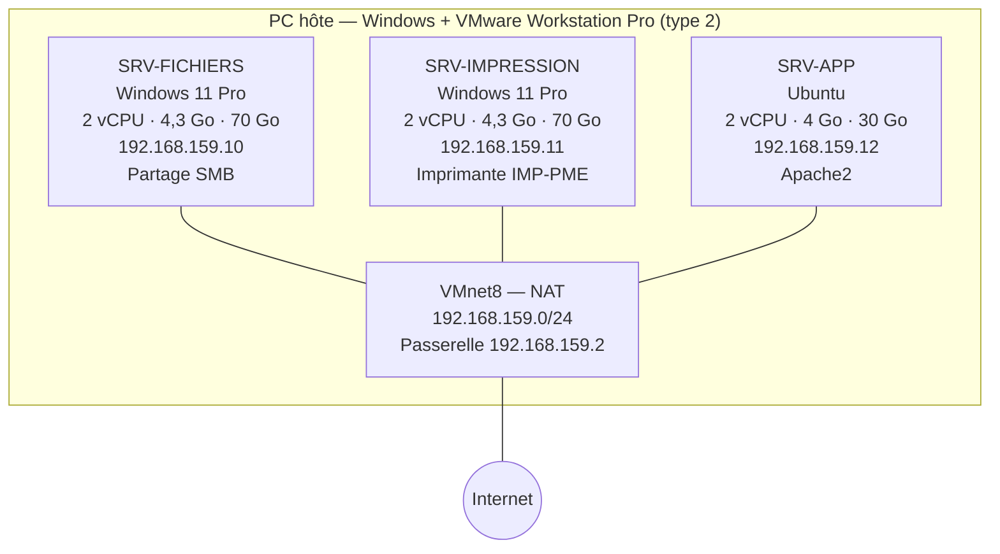

# Infrastructure virtuelle pour une PME — 3 serveurs consolidés

> Projet du module *Mettre en place et exploiter une plateforme de virtualisation* (Module 190) — Geneva Institute of Technology, Bachelor IT 1re année.

**Contexte :** une PME de 15 salariés veut virtualiser ses 3 serveurs physiques (fichiers, impression, applicatif) pour réduire ses coûts matériels.

**Technologies :** VMware Workstation Pro · Windows 11 · Ubuntu · Apache2 · SMB · NAT VMware

**Compétences mises en œuvre :**
- Choix et justification d'un hyperviseur (type 1 vs type 2)
- Création et dimensionnement de 3 VM selon leur rôle (vCPU, RAM, disque)
- Réseau virtuel NAT et adressage IP fixe hors plage DHCP
- Mise en service des rôles : partage SMB, imprimante partagée, serveur web Apache
- Schéma et fiche d'architecture, analyse des limites (SPOF, sauvegardes, Windows Server / AD)

---

## Consignes

1. Installer l'hyperviseur sur la machine hôte.
2. Créer 3 VM avec des rôles distincts (fichiers, impression, application).
3. Configurer le réseau virtuel pour que les VM communiquent entre elles et avec l'extérieur.
4. Allouer les ressources selon les besoins estimés de chaque rôle.
5. Démarrer et valider le fonctionnement des 3 VM.
6. Rédiger un schéma et une fiche d'architecture.

---

## 1. Choix et installation de l'hyperviseur

**Hyperviseur retenu : VMware Workstation Pro** (hyperviseur de **type 2**, installé sur le Windows de la machine hôte).

| Critère | Justification |
| --- | --- |
| Disponibilité | Déjà installé et utilisé sur ma machine |
| Coût | Gratuit pour un usage personnel / éducatif |
| Réseau virtuel | Gestion simple des réseaux NAT / Host-only / Bridged via le *Virtual Network Editor* |
| Limite | Type 2 = dépend de l'OS hôte → adapté à un lab / POC. En production, la PME utiliserait un type 1 (ESXi, Proxmox VE, Hyper-V Server) |

**Prérequis vérifiés sur l'hôte :**
- Virtualisation matérielle activée dans le BIOS/UEFI (Intel VT-x / AMD-V) → Gestionnaire des tâches → Performances → CPU → « Virtualisation : Activé »
- Espace disque suffisant sur un disque local (SSD de préférence) pour stocker les 3 VM


---

## 2. Création des 3 VM

| VM | Rôle | OS invité |
| --- | --- | --- |
| **SRV-FICHIERS** | Serveur de fichiers (partages SMB) | Windows 11 Pro |
| **SRV-IMPRESSION** | Serveur d'impression (imprimante partagée) | Windows 11 Pro |
| **SRV-APP** | Serveur applicatif (serveur web Apache) | Ubuntu |

### 2.1 Création d'une VM Windows 11 (SRV-FICHIERS / SRV-IMPRESSION)

ISO Windows 11 téléchargée sur le site officiel Microsoft : https://www.microsoft.com/en-us/software-download/windows11


**File → New Virtual Machine** dans VMware Workstation :


Sélectionner **Typical** :


Sélectionner l'ISO Windows 11 :


Vérifier que l'OS détecté correspond :


Nommer la VM et choisir son emplacement (disque local pour de meilleures performances) :


Mot de passe de chiffrement (requis par le vTPM de Windows 11) :


Disque : **64 Go minimum** pour Windows 11, option **Split virtual disk into multiple files** :


**Customize Hardware** pour ajuster CPU / RAM, puis **Finish** :


**Installation de Windows 11 :**

Langue, puis clavier :


« Je n'ai pas de clé de produit », puis choix de l'édition **Windows 11 Pro** :


Disque de destination puis **Installer** :


Pour éviter l'obligation du compte Microsoft / connexion Internet à la 1re configuration : **Shift + F10** puis :
```
oobe\bypassnro
```

VM Windows 11 opérationnelle :


➡️ Même procédure pour la 2e VM Windows 11.

### 2.2 Création de la VM Ubuntu (SRV-APP)

ISO Ubuntu : https://ubuntu.com/download/desktop


**New Virtual Machine → Typical**, puis sélection de l'ISO :


Utilisateur Linux :


Nom / emplacement :


Disque (20 Go minimum, ici 30 Go) en **Split** :


Hardware puis **Finish** :


Installation : langue → accessibilité → clavier → réseau → mises à jour → installation :


VM Ubuntu opérationnelle :


### 2.3 Renommer les VM

VMware → clic droit sur la VM → **Settings → Options → General → Virtual machine name** → `SRV-FICHIERS` / `SRV-IMPRESSION` / `SRV-APP`.


---

## 3. Configuration du réseau virtuel

**Mode choisi : NAT (VMnet8)** sur les 3 VM.

| Mode VMware | VM ↔ VM | VM → Internet | Choix |
| --- | --- | --- | --- |
| Host-only (VMnet1) | ✅ | ❌ | Non : pas d'accès extérieur |
| Bridged (VMnet0) | ✅ | ✅ | Non : les VM prennent une IP sur le réseau de l'école |
| **NAT (VMnet8)** | ✅ | ✅ | **Oui** : réseau isolé + accès Internet via l'hôte |

**Configuration :** VM → **Settings → Network Adapter → NAT: Used to share the host's IP address**.


**Adresses IP des VM** (fixes, pour que les serveurs gardent toujours la même adresse) :

| VM | Adresse IP | Masque | Passerelle | DNS |
| --- | --- | --- | --- | --- |
| SRV-FICHIERS | 192.168.159.10 | 255.255.255.0 | 192.168.159.2 | 192.168.159.2 |
| SRV-IMPRESSION | 192.168.159.11 | 255.255.255.0 | 192.168.159.2 | 192.168.159.2 |
| SRV-APP | 192.168.159.12 | 255.255.255.0 | 192.168.159.2 | 192.168.159.2 |

> Sous-réseau VMnet8 relevé dans le Virtual Network Editor : `192.168.159.0/24` (masque `255.255.255.0`). Les IP en `.10-.12` sont hors de la plage DHCP par défaut de VMware (`.128-.254`) → pas de conflit.

- Windows : `ncpa.cpl` → Ethernet0 → Propriétés → IPv4 → IP manuelle


- Ubuntu : Paramètres → Réseau → filaire → IPv4 → Manuel

Configuration IPv4 manuelle de SRV-APP (Ubuntu) :


**Autoriser le ping sur les VM Windows** (le pare-feu Windows bloque l'ICMP par défaut). Dans PowerShell en administrateur, sur SRV-FICHIERS et SRV-IMPRESSION :

```powershell
netsh advfirewall firewall add rule name="Autoriser Ping" protocol=icmpv4:8,any dir=in action=allow
```

---

## 4. Allocation des ressources

Objectif : allouer des ressources **cohérentes avec chaque rôle**, sans dépasser les capacités de l'hôte (garder de la marge pour Windows hôte).

| VM | vCPU | RAM | Disque | Justification |
| --- | --- | --- | --- | --- |
| **SRV-FICHIERS** | 2 | 4,3 Go | 70 Go (NVMe) | Peu de calcul, mais rôle **le plus gourmand en stockage** (fichiers des 15 salariés) → voir remarque ci-dessous |
| **SRV-IMPRESSION** | 2 | 4,3 Go | 70 Go (NVMe) | Rôle **le plus léger** (file d'attente d'impression) : juste au-dessus du minimum Windows 11 (2 vCPU / 4 Go / 64 Go) |
| **SRV-APP** | 2 | 4 Go | 30 Go (SCSI) | Rôle **le plus sollicité en CPU/RAM** (application utilisée par tous) ; Ubuntu étant plus léger que Windows, 4 Go laissent plus de ressources à l'application |
| **Total** | **6 vCPU** | **~12,6 Go** | **170 Go** (provisionnement dynamique) | |

> ⚠️ **Remarque — capacité de SRV-FICHIERS :** 70 Go (dont ~60 Go pris par Windows 11) est **insuffisant** pour stocker durablement les fichiers de 15 salariés. En production, il faudrait **augmenter la capacité** : soit agrandir le disque (**Settings → Hard Disk → Expand…**), soit, mieux, **ajouter un 2e disque dédié aux données** (ex. 100 Go+) pour séparer l'OS des fichiers.

**Modifier les ressources** (VM éteinte) : **VM → Settings** :
- **Memory** → RAM voulue (ex. 4,3 Go ≈ 4400 MB)
- **Processors** → 1 processeur × 2 cœurs
- **Hard Disk** → **Expand…** pour agrandir un disque, ou **Add → Hard Disk** pour en ajouter un

Settings de SRV-FICHIERS → le bouton **Expand…** permettrait d'augmenter sa capacité.


---

## 5. Démarrage et validation des 3 VM

### 5.1 Rôle de chaque VM

**SRV-FICHIERS — partage SMB**
1. Dans l'Explorateur de fichiers : **Ce PC → Disque local (C:)** → clic droit → **Nouveau → Dossier** → `Partage1` (sur le disque système, faute de disque de données — voir remarque partie 4)
2. Clic droit sur `Partage1` → **Propriétés → Partage → Partage avancé…** → cocher **Partager ce dossier** → **Autorisations** (*Tout le monde : Lecture*)
3. Le dossier est partagé, chemin réseau : `\\PCO1GIT\Partage1`


4. Test depuis SRV-IMPRESSION : **Win + R** → `\\192.168.159.10\Partage1`


**SRV-IMPRESSION — imprimante partagée**
1. **Paramètres → Bluetooth et appareils → Imprimantes et scanners** → *Microsoft Print to PDF* → **Propriétés de l'imprimante → Partage** → cocher « Partager cette imprimante » (nom : `IMP-PME`)
2. Test depuis SRV-FICHIERS : `\\192.168.159.11` → double-clic sur `IMP-PME` pour l'installer → imprimer une page de test

**SRV-APP — serveur web (application)**
```bash
sudo apt update
sudo apt install apache2 -y
sudo systemctl status apache2
```
Test depuis une VM Windows : navigateur → `http://192.168.159.12` → page « Apache2 Default Page ».

### 5.2 Tests de connectivité

| Test | Commande | Résultat attendu |
| --- | --- | --- |
| SRV-FICHIERS → SRV-IMPRESSION | `ping 192.168.159.11` | ✅ Réponses |
| SRV-FICHIERS → SRV-APP | `ping 192.168.159.12` | ✅ Réponses |
| SRV-APP → SRV-FICHIERS | `ping -c 4 192.168.159.10` | ✅ Réponses |
| VM → passerelle NAT | `ping 192.168.159.2` | ✅ Réponses |
| VM → Internet (IP) | `ping 8.8.8.8` | ✅ Réponses |

**SRV-FICHIERS → SRV-IMPRESSION et SRV-FICHIERS → SRV-APP** (0 % de perte) :


**SRV-APP → SRV-FICHIERS** (0 % de perte) :


> 💡 TTL=128 → la machine qui répond est sous **Windows** ; TTL=64 → sous **Linux**. On le voit bien : SRV-IMPRESSION répond avec un TTL de 128, SRV-APP avec un TTL de 64.

---

## 6. Schéma d'architecture



---

## 7. Fiche d'architecture

| Élément | Valeur |
| --- | --- |
| Hyperviseur | VMware Workstation Pro (type 2) |
| Réseau virtuel | VMnet8 — NAT, `192.168.159.0/24`, passerelle/DNS `192.168.159.2` |
| Nombre de VM | 3 |
| Ressources totales allouées | 6 vCPU · ~12,6 Go RAM · 170 Go (dynamique) |

| VM | OS | vCPU | RAM | Disque(s) | IP | Service |
| --- | --- | --- | --- | --- | --- | --- |
| SRV-FICHIERS | Windows 11 Pro | 2 | 4,3 Go | 70 Go (à augmenter) | 192.168.159.10 | Partage SMB `\\PCO1GIT\Partage1` |
| SRV-IMPRESSION | Windows 11 Pro | 2 | 4,3 Go | 70 Go | 192.168.159.11 | Imprimante partagée `IMP-PME` |
| SRV-APP | Ubuntu | 2 | 4 Go | 30 Go | 192.168.159.12 | Serveur web Apache2 (port 80) |

---

## 8. Bilan

- Les 3 serveurs physiques de la PME tournent désormais sur **une seule machine** → économie de matériel, d'énergie et de place.
- Les VM communiquent entre elles et accèdent à Internet via le **NAT VMware**.
- Les ressources sont **dimensionnées selon le rôle** (stockage pour le serveur de fichiers, minimum pour l'impression, priorité à l'applicatif).

**Limites / améliorations pour une vraie PME :**
- Passer sur un hyperviseur **type 1** (Proxmox VE, ESXi, Hyper-V Server) sur un vrai serveur.
- Utiliser **Windows Server** (rôles *Serveur de fichiers* et *Serveur d'impression*) au lieu de Windows 11, et un Active Directory pour gérer les droits des 15 salariés.
- Mettre en place des **sauvegardes** sur un support externe (un snapshot n'est pas une sauvegarde).
- L'hôte unique est un **point de défaillance unique (SPOF)** → à terme : 2 hôtes + stockage partagé + haute disponibilité (voir le projet [01 — Cluster Proxmox HA](../01-virtualisation-proxmox-ha/README.md)).
